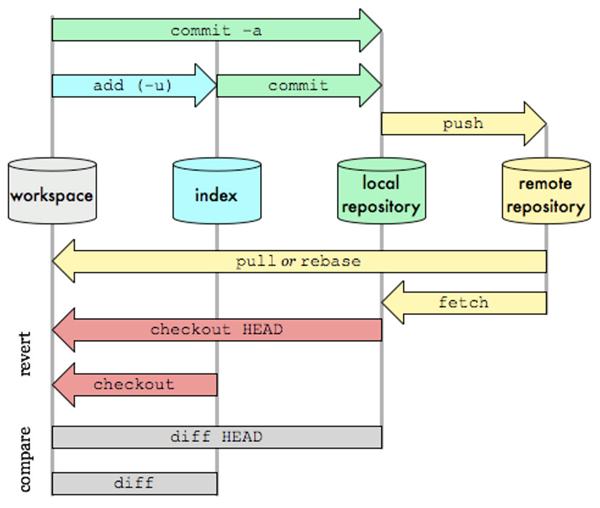

# Table of contents

- [Table of contents](#table-of-contents)
- [Github Cheatsheet](#github-cheatsheet)
  - [Commands](#commands)
    - [Generel](#generel)
    - [Überschreiben / Hinzufügen / Bearbeiten](#überschreiben--hinzufügen--bearbeiten)
  - [Aufbau](#aufbau)

# Github Cheatsheet

In diesem Cheatsheet werde ich wichtige Git commands behandeln welche ich im Modul 300 benötigen werde. Wichtig zu sagen ist, 

## Commands

### Generel

Mit diesen Commands kann Git zeigen, wer man ist und mehr Infos zum "Author" geben

    git config --global user.name "Christian Schnittert"

    git config --global user.email "christian2424@outlook.de"

    git remote -v (Remote Server Repository anzeigen)

Um ein Repository überhaupt zu erstellen kann man mit folgenden Commands ein Repo erstellen oder clonen

    git init
    git clone /pfad/zum/repository
    git clone username@host:/pfad/zum/repository

    git pull

### Überschreiben / Hinzufügen / Bearbeiten

Um Neuerungen hochzuladen muss man zuerst die Dateien "Adden" um sie anschliessend zu commiten

    git add <filename>
    git add *

    git commit -m "Commit Nachricht"
    git commit -a  (Es wird alles commited)

    git push

    gitk (Wird alles angezeigt)

Um bestimte Dateien zu Löschen / Verschieben kann man sie mit folgenden Commands bearbeiten

    git rm /pfad/zur/datei
    git mv /pfad/zur/datei

## Aufbau

Hier noch eine Grafik zum Git:

